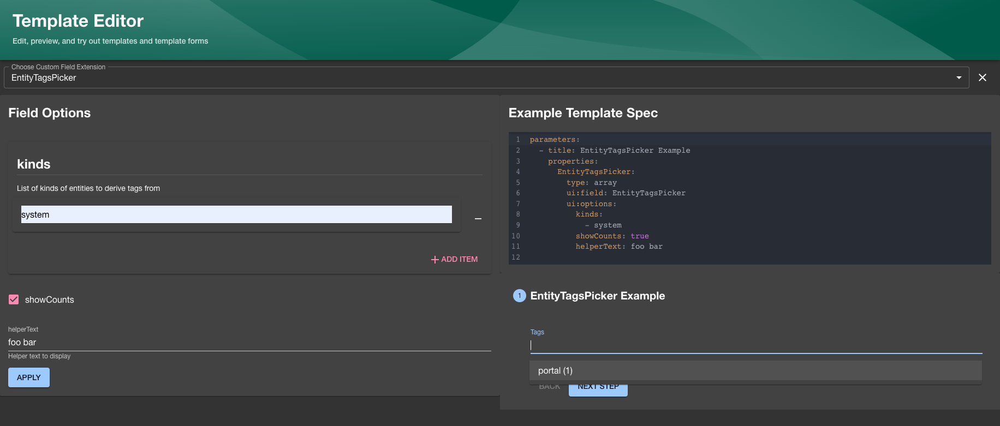

::::info
This documentation is written for the new frontend system, which is the default
in new Backstage apps. If your Backstage app still uses the old frontend system,
read the [old frontend system version of this guide](./writing-custom-field-extensions--old.md)
instead.
::::

Collecting input from the user is a very large part of the scaffolding process
and Software Templates as a whole. Sometimes the built in components and fields
just aren't good enough, and sometimes you want to enrich the form that the
users sees with better inputs that fit better.

This is where `Custom Field Extensions` come in.

With them you can show your own `React` Components and use them to control the
state of the JSON schema, as well as provide your own validation functions to
validate the data too.

## Creating a Field Extension

Field extensions are a way to combine an ID, a `React` Component and a
`validation` function together in a modular way that you can then register as
an extension in your Backstage app.

You can create your own field extension by using the `FormFieldBlueprint` from
`@backstage/plugin-scaffolder-react/alpha` together with `createFormField`, which
types the component, validation, and optional schema.

As an example, we will create a component that validates whether a string is in the `Kebab-case` pattern.

First, create the component and validation function:

```tsx
// packages/app/src/scaffolder/ValidateKebabCase/ValidateKebabCaseExtension.tsx
import { FieldExtensionComponentProps } from '@backstage/plugin-scaffolder-react';
import type { FieldValidation } from '@rjsf/utils';
import FormControl from '@material-ui/core/FormControl';
import FormHelperText from '@material-ui/core/FormHelperText';
import Input from '@material-ui/core/Input';
import InputLabel from '@material-ui/core/InputLabel';

export const ValidateKebabCase = ({
  onChange,
  rawErrors,
  required,
  formData,
}: FieldExtensionComponentProps<string>) => {
  return (
    <FormControl
      margin="normal"
      required={required}
      error={rawErrors?.length > 0 && !formData}
    >
      <InputLabel htmlFor="validateName">Name</InputLabel>
      <Input
        id="validateName"
        aria-describedby="entityName"
        onChange={e => onChange(e.target?.value)}
      />
      <FormHelperText id="entityName">
        Use only letters, numbers, hyphens and underscores
      </FormHelperText>
    </FormControl>
  );
};

export const validateKebabCaseValidation = (
  value: string,
  validation: FieldValidation,
) => {
  const kebabCase = /^[a-z0-9-_]+$/g.test(value);

  if (kebabCase === false) {
    validation.addError(
      `Only use letters, numbers, hyphen ("-") and underscore ("_").`,
    );
  }
};
```

Then, create the extension using `FormFieldBlueprint` and `createFormField`:

```tsx
// packages/app/src/scaffolder/ValidateKebabCase/extensions.ts
import {
  FormFieldBlueprint,
  createFormField,
} from '@backstage/plugin-scaffolder-react/alpha';
import {
  ValidateKebabCase,
  validateKebabCaseValidation,
} from './ValidateKebabCaseExtension';

export const ValidateKebabCaseFieldExtension = FormFieldBlueprint.make({
  name: 'validate-kebab-case',
  params: {
    field: async () =>
      createFormField({
        name: 'ValidateKebabCase',
        component: ValidateKebabCase,
        validation: validateKebabCaseValidation,
      }),
  },
});
```

```tsx
// packages/app/src/scaffolder/ValidateKebabCase/index.ts
export { ValidateKebabCaseFieldExtension } from './extensions';
```

Once the extension is created, install it in your app by wrapping it in a frontend module and passing it to `createApp`:

```tsx title="packages/app/src/scaffolder/scaffolderModule.ts"
import { createFrontendModule } from '@backstage/frontend-plugin-api';
import { ValidateKebabCaseFieldExtension } from './ValidateKebabCase';

export const scaffolderCustomizations = createFrontendModule({
  pluginId: 'scaffolder',
  extensions: [ValidateKebabCaseFieldExtension],
});
```

```tsx title="packages/app/src/App.tsx"
import { createApp } from '@backstage/frontend-defaults';
import { scaffolderCustomizations } from './scaffolder/scaffolderModule';

const app = createApp({
  features: [scaffolderCustomizations],
});

export default app.createRoot();
```

### Async Validation Function

A validation function can be asynchronous and use [Utility APIs](https://backstage.io/docs/api/utility-apis/) via the `ApiHolder` in the [field validation context](https://backstage.io/api/stable/types/_backstage_plugin-scaffolder-react.index.CustomFieldValidator.html). The example below uses the `catalogApiRef` to check if the submitted value (in this scenario an entity ref) exists in the catalog.

```tsx
import { FieldValidation } from '@rjsf/utils';
import { ApiHolder } from '@backstage/core-plugin-api';
import { catalogApiRef } from '@backstage/plugin-catalog-react';

export const customFieldExtensionValidator = async (
  value: string,
  validation: FieldValidation,
  context: { apiHolder: ApiHolder },
) => {
  const catalogApi = context.apiHolder.get(catalogApiRef);

  if ((await catalogApi?.getEntityByRef(value)) === undefined) {
    validation.addError('Entity not found');
  }
};
```

## Using the Custom Field Extension

Once registered, you can use the `ui:field` property in your templates to
reference the name of the custom field extension:

```yaml
apiVersion: scaffolder.backstage.io/v1beta3
kind: Template
metadata:
  name: Test template
  title: Test template with custom extension
  description: Test template
spec:
  parameters:
    - title: Fill in some steps
      required:
        - name
      properties:
        name:
          title: Name
          type: string
          description: My custom name for the component
          ui:field: ValidateKebabCase
  steps:
  [...]
```

## Access Data from other Fields

Custom fields extensions can read data from other fields in the form via the form context. This
is something that we discourage due to the coupling that it creates, but is sometimes still
the most sensible solution.

```tsx
import {
  FormFieldBlueprint,
  createFormField,
} from '@backstage/plugin-scaffolder-react/alpha';
import { FieldExtensionComponentProps } from '@backstage/plugin-scaffolder-react';

const CustomFieldExtensionComponent = (props: FieldExtensionComponentProps<string[]>) => {
  const { formData } = props.formContext;
  ...
};

const CustomFieldExtension = FormFieldBlueprint.make({
  name: 'custom-field',
  params: {
    field: async () =>
      createFormField({
        name: 'custom-field',
        component: CustomFieldExtensionComponent,
        validation: ...,
      }),
  },
});
```

## Previewing Custom Field Extensions

You can preview custom field extensions you write in the Backstage UI using the Custom Field Explorer
(accessible via the `/create/edit` route by default):



In order to make your new custom field extension available in the explorer you will have to define a
JSON schema that describes the input/output types on your field like in the following example:

```tsx
// packages/app/src/scaffolder/MyCustomExtensionWithOptions/MyCustomExtensionWithOptions.tsx
import FormControl from '@material-ui/core/FormControl';
import { FieldExtensionComponentProps } from '@backstage/plugin-scaffolder-react';

export const MyCustomExtensionWithOptionsSchema = {
  uiOptions: {
    type: 'object',
    properties: {
      focused: {
        description: 'Whether to focus this field',
        type: 'boolean',
      },
    },
  },
  returnValue: { type: 'string' },
};

export const MyCustomExtensionWithOptions = ({
  onChange,
  rawErrors,
  required,
  formData,
  uiSchema,
}: FieldExtensionComponentProps<string, { focused?: boolean }>) => {
  const focused = uiSchema['ui:options']?.focused;

  return (
    <FormControl
      margin="normal"
      required={required}
      error={rawErrors?.length > 0 && !formData}
      onChange={onChange}
      focused={focused}
    />
  );
};
```

```tsx
// packages/app/src/scaffolder/MyCustomExtensionWithOptions/extensions.ts
import {
  FormFieldBlueprint,
  createFormField,
} from '@backstage/plugin-scaffolder-react/alpha';
import {
  MyCustomExtensionWithOptions,
  MyCustomExtensionWithOptionsSchema,
} from './MyCustomExtensionWithOptions';

export const MyCustomFieldWithOptionsExtension = FormFieldBlueprint.make({
  name: 'MyCustomExtensionWithOptions',
  params: {
    field: async () =>
      createFormField({
        name: 'MyCustomExtensionWithOptions',
        component: MyCustomExtensionWithOptions,
        schema: MyCustomExtensionWithOptionsSchema,
      }),
  },
});
```

We recommend using a library like [zod](https://github.com/colinhacks/zod) to define your schema
and the provided `makeFieldSchemaFromZod` helper utility function to generate both the JSON schema
and type for your field props to preventing having to duplicate the definitions:

```tsx
// packages/app/src/scaffolder/MyCustomExtensionWithOptions/MyCustomExtensionWithOptions.tsx
import FormControl from '@material-ui/core/FormControl';
import { z } from 'zod/v3';
import { makeFieldSchemaFromZod } from '@backstage/plugin-scaffolder';

const MyCustomExtensionWithOptionsFieldSchema = makeFieldSchemaFromZod(
  z.string(),
  z.object({
    focused: z.boolean().optional().describe('Whether to focus this field'),
  }),
);

export const MyCustomExtensionWithOptionsSchema =
  MyCustomExtensionWithOptionsFieldSchema.schema;

type MyCustomExtensionWithOptionsProps =
  typeof MyCustomExtensionWithOptionsFieldSchema.type;

export const MyCustomExtensionWithOptions = ({
  onChange,
  rawErrors,
  required,
  formData,
  uiSchema,
}: MyCustomExtensionWithOptionsProps) => {
  const focused = uiSchema['ui:options']?.focused;

  return (
    <FormControl
      margin="normal"
      required={required}
      error={rawErrors?.length > 0 && !formData}
      onChange={onChange}
      focused={focused}
    />
  );
};
```
