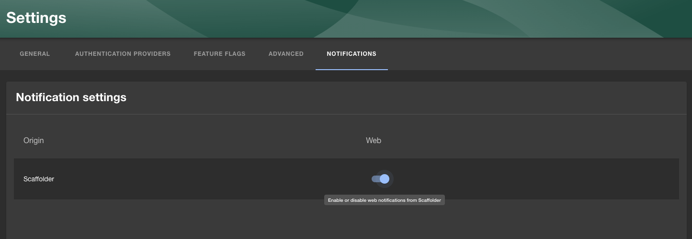

::::info
This documentation is written for the new frontend system, which is the default
in new Backstage apps. If your Backstage app still uses the old frontend system,
read the [old frontend system version of this guide](./index--old.md)
instead.
::::

The Backstage Notifications System provides a way for plugins and external services to send notifications to Backstage users.
These notifications are displayed in the dedicated page of the Backstage frontend UI or by frontend plugins per specific scenarios.
Additionally, notifications can be sent to external channels (like email) via "processors" implemented within plugins.

Notifications can be optionally extended with the signals plugin, which provides a push mechanism to ensure users receive notifications immediately.

### Upgrade to the latest version of Backstage

To ensure your version of Backstage has all the latest notifications and signals related functionality, it's important to upgrade to the latest version. The [Backstage upgrade helper](https://backstage.github.io/upgrade-helper/) is a great tool to help ensure that you've made all the necessary changes during the upgrade!

## About notifications

Notifications are messages sent to either individual users or groups.
They are not intended for inter-process communication of any kind.

There are two basic types of notifications:

- **Broadcast**: Messages sent to all users of Backstage.
- **Entity**: Messages delivered to specific listed entities, such as Users or Groups.

Example of use-cases:

- System-wide announcements or alerts
- Notifications for component owners, e.g. build failures, successful deployments, new vulnerabilities
- Notifications for individuals, e.g. updates you have subscribed to, new required training courses
- Notifications pertaining to a particular entity in the catalog: A notification might apply to an entity and the owning team.

## Installation

:::note

As of the `1.42.0` release of Backstage, Notifications and Signals are installed as part of the default `@backstage/create-app` instance which means you won't need to follow the installation steps outlined here. The only exception to this is adding the [Notifications sidebar item](#add-notifications-sidebar-item) and optionally [Notifications tab to User Settings](#user-specific-notification-settings).

:::

The following sections will walk you through the installation of the various parts of the Backstage Notification System.

### Add Notifications Backend

First we need to add the backend package:

```bash title="From your Backstage root directory"
yarn --cwd packages/backend add @backstage/plugin-notifications-backend
```

Then we need to add it to our backend:

```ts title="packages/backend/src/index.ts"
const backend = createBackend();
// ...
backend.add(import('@backstage/plugin-notifications-backend'));
```

### Add Notifications Frontend

First we need to add the frontend package:

```bash title="From your Backstage root directory"
yarn --cwd packages/app add @backstage/plugin-notifications
```

Once installed, the notifications plugin is automatically available in your app through the default feature discovery. It provides a notifications page at `/notifications` and the notifications API. For more details and alternative installation methods, see [installing plugins](../frontend-system/building-apps/05-installing-plugins.md).

### Add Notifications Sidebar Item

The notifications plugin does not yet include a built-in navigation item, so you need to add the `NotificationsSidebarItem` component to your sidebar manually. If you have a custom sidebar through a `NavContentBlueprint`, add the component there:

```tsx
import { NotificationsSidebarItem } from '@backstage/plugin-notifications';

// Inside your NavContentBlueprint component:
<Sidebar>
  <SidebarGroup label="Menu" icon={<MenuIcon />}>
    {/* ... other items ... */}
  </SidebarGroup>
  <SidebarGroup label="Settings" icon={<SettingsIcon />} to="/settings">
    <NotificationsSidebarItem />
  </SidebarGroup>
</Sidebar>;
```

### Optional: Add Signals

The use of signals is optional but improves the user experience by providing real-time push updates.

#### Optional: Add Signals Backend

Add signals to your backend by first adding the backend package:

```bash title="From your Backstage root directory"
yarn --cwd packages/backend add @backstage/plugin-signals-backend
```

Then add the signals plugin to your backend:

```ts title="packages/backend/src/index.ts"
const backend = createBackend();
// ...
backend.add(import('@backstage/plugin-signals-backend'));
```

#### Optional: Signals Frontend

Start with adding the frontend package:

```bash title="From your Backstage root directory"
yarn --cwd packages/app add @backstage/plugin-signals
```

Once installed, the signals plugin is automatically available in your app through the default feature discovery. No additional configuration is required. If the signals plugin is properly configured, it will be automatically discovered by the notifications plugin and used.

### User-specific notification settings

The notifications plugin provides a way for users to manage their notification settings. To enable this, you can create a frontend module that adds a settings tab to the user-settings plugin using the `SubPageBlueprint`:

```tsx title="packages/app/src/modules/notificationSettings.tsx"
import { createFrontendModule } from '@backstage/frontend-plugin-api';
import { SubPageBlueprint } from '@backstage/frontend-plugin-api';
import { Content } from '@backstage/core-components';
import { UserNotificationSettingsCard } from '@backstage/plugin-notifications';

export const notificationSettingsModule = createFrontendModule({
  pluginId: 'user-settings',
  extensions: [
    SubPageBlueprint.make({
      name: 'notifications',
      params: {
        path: 'notifications',
        title: 'Notifications',
        loader: () =>
          Promise.resolve(
            <Content>
              <UserNotificationSettingsCard
                originNames={{ 'plugin:scaffolder': 'Scaffolder' }}
              />
            </Content>,
          ),
      },
    }),
  ],
});
```

Then install the module in your app by adding it to the features array of `createApp`, or through default feature discovery if your app is set up for it.



You can customize the origin names shown in the UI by passing an object where the keys are the origins and the values are the names you want to show in the UI.

Each notification processor will receive its own row in the settings page, where the user can enable or disable notifications from that processor.

### Default notification settings

You can configure default notification settings for all users in your `app-config.yaml` file. This allows you to set up notification preferences globally, such as disabling specific channels or origins by default, implementing an opt-in strategy instead of opt-out.

#### Channel-level defaults

You can set a default enabled state for an entire channel. When set to `false`, the channel uses an opt-in strategy where notifications are disabled by default unless explicitly enabled by the user or for specific origins.

```yaml
notifications:
  defaultSettings:
    channels:
      - id: 'Web'
        enabled: false # Opt-in strategy: channel disabled by default
      - id: 'Email'
        enabled: true # Opt-out strategy: channel enabled by default (default behavior)
```

#### Origin-level defaults

You can also configure defaults for specific origins within a channel:

```yaml
notifications:
  defaultSettings:
    channels:
      - id: 'Web'
        enabled: true # Channel is enabled by default
        origins:
          - id: 'plugin:scaffolder'
            enabled: false # Disable scaffolder notifications by default
          - id: 'plugin:catalog'
            enabled: true # Enable catalog notifications by default
```

#### Topic-level defaults

For even more granular control, you can set defaults for specific topics within origins:

```yaml
notifications:
  defaultSettings:
    channels:
      - id: 'Email'
        enabled: false # Email is opt-in by default
        origins:
          - id: 'plugin:catalog'
            enabled: true # But catalog notifications are enabled
            topics:
              - id: 'entity:validation:error'
                enabled: false # Except validation errors
```

**Note:** If a channel's `enabled` flag is not set, it defaults to `true` for backwards compatibility. When a channel is set to `enabled: false`, all origins within that channel default to disabled unless explicitly enabled.

### Automatic notification cleanup

Notifications are deleted automatically after a certain period of time to prevent the database from growing indefinitely
and to keep the user interface clean. The default retention period is set to 1 year, meaning that notifications older
than that will be deleted automatically.

The retention period can be configured by setting the `notifications.retention` in the `app-config.yaml` file.

```yaml
notifications:
  retention: 1y
```

If the retention is set to false, notifications will not be automatically deleted.

## Scaffolder Action

:::note

As of the `1.42.0` release of Backstage, the Notifications Scaffolder action is installed as part of the default `@backstage/create-app` instance which means you won't need to follow the installations steps outlined here. Feel free to skip to the [Basic Example](#basic-example).

:::

There is also a Scaffolder action that you can use to send a notification as part of your Software Template.

First we need to add the backend package:

```bash title="From your Backstage root directory"
yarn --cwd packages/backend add @backstage/plugin-scaffolder-backend-module-notifications
```

Then we need to add it to our backend:

```ts title="packages/backend/src/index.ts"
const backend = createBackend();
// ...
backend.add(
  import('@backstage/plugin-scaffolder-backend-module-notifications'),
);
```

### Basic Example

Here's an example of how you can use it in your Software Template, more details and examples can be found in the "Installed actions" screen in your Backstage instances:

```yaml title="template.yaml"
steps:
  - id: notify
    name: Notify
    action: notification:send
    input:
      recipients: entity
      entityRefs:
        - user:default/guest
      title: 'Template executed'
      info: 'Your template has been executed'
      severity: 'normal'
```

The example above would send a notification to the Guest user (`user:default/guest`)

## Additional info

An example of a backend plugin sending notifications can be found in the [`@backstage/plugin-scaffolder-backend-module-notifications` package](https://github.com/backstage/backstage/tree/master/plugins/scaffolder-backend-module-notifications).

Sources of the notifications and signals plugins:

- [notifications](https://github.com/backstage/backstage/blob/master/plugins/notifications)
- [notifications-backend](https://github.com/backstage/backstage/blob/master/plugins/notifications-backend)
- [notifications-common](https://github.com/backstage/backstage/blob/master/plugins/notifications-common)
- [notifications-node](https://github.com/backstage/backstage/blob/master/plugins/notifications-node)
- [signals-backend](https://github.com/backstage/backstage/blob/master/plugins/signals-backend)
- [signals](https://github.com/backstage/backstage/blob/master/plugins/signals)
- [signals-node](https://github.com/backstage/backstage/blob/master/plugins/signals-node)
- [signals-react](https://github.com/backstage/backstage/blob/master/plugins/signals-react)
