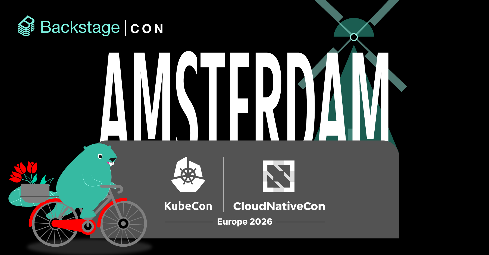
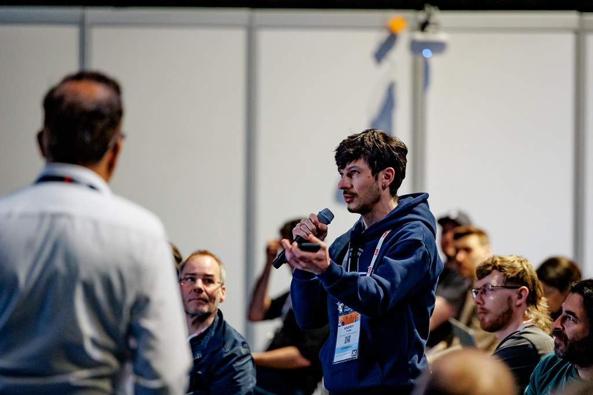
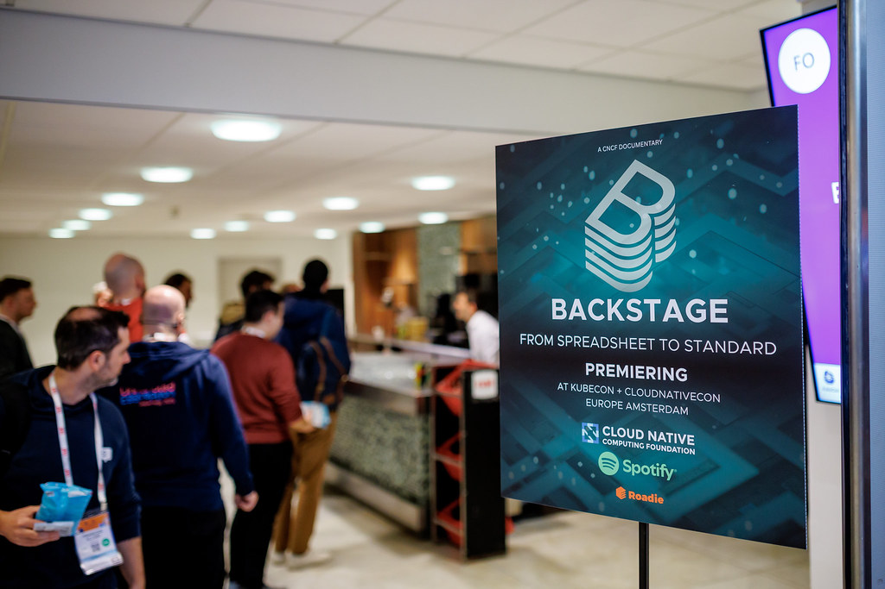
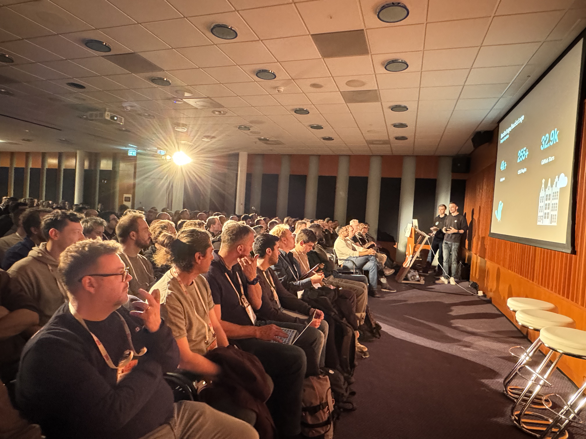
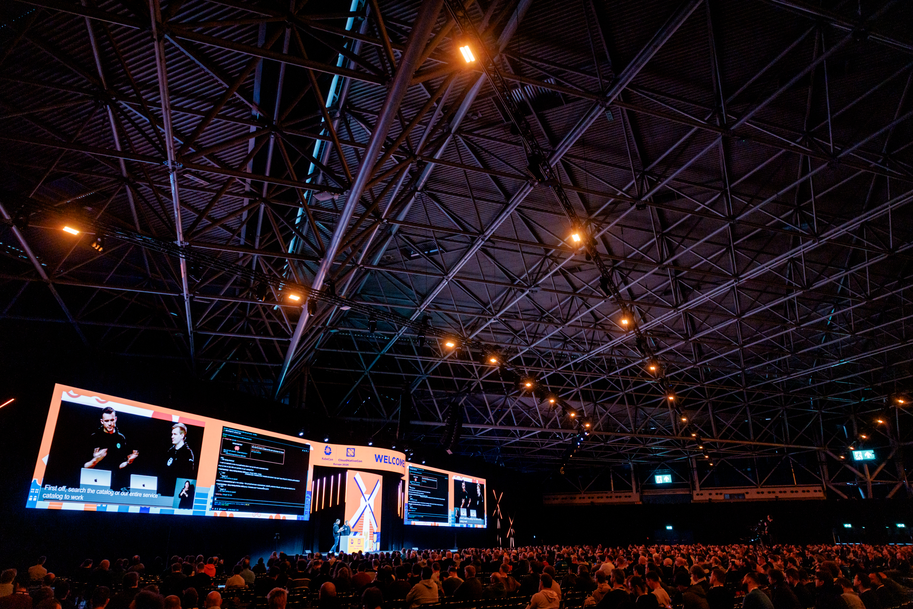
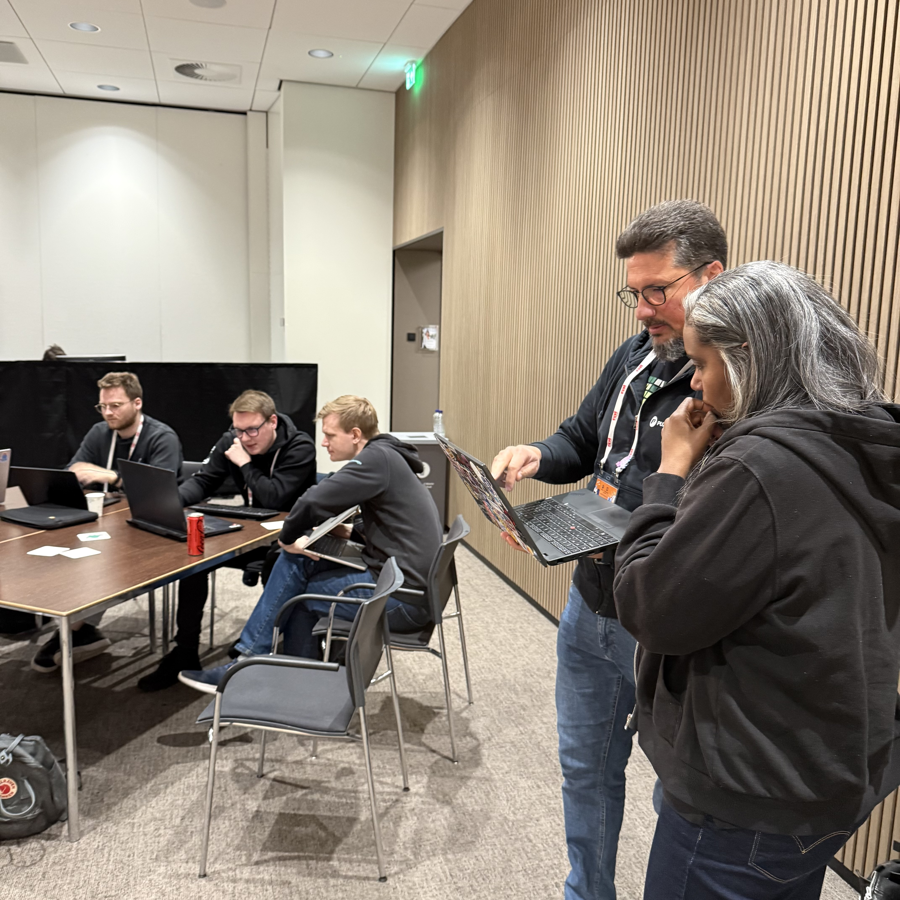

Amsterdam delivered. From the moment BackstageCon opened its doors on March 23, the Backstage community was in full force — long-time contributors comparing notes with teams who had only just started their IDP journey. Across four days of BackstageCon and KubeCon + CloudNativeCon Europe 2026, there was a lot to take in: an energetic day of community talks, a documentary premiere, a standing room–only maintainers session, a live demo on the Keynote mainstage, and a ContribFest that turned issues into pull requests in real time. Read on for the highlights — and catch up on all the BackstageCon talks in the [full recordings playlist](https://youtube.com/playlist?list=PL8iP9yIjU0Q0eZv3LncHLG3g5itFec995&si=dAZ-Gg2A0hspfNbx).

{/* truncate */}

## BackstageCon: What the community is building

📸 _[CNCF](https://www.flickr.com/photos/143247548@N03/albums/72177720332674037/)_

BackstageCon kicked off the week with a full day of talks organized by the community, for the community — emceed by [Balaji Sivasubramanian](https://www.linkedin.com/in/balajisiva/) (Red Hat) and [André Wanlin](https://www.linkedin.com/in/andr%C3%A9-wanlin-31a00a16a/) (Spotify). The [full schedule](https://colocatedeventseu2026.sched.com/overview/area/BackstageCon) had something for every stage of the Backstage journey, but a few themes stood out across the day.

On the engineering side, Booking.com's [Symbat Nurbay](https://www.linkedin.com/in/symbat-nurbay-b981a6134/) and [Xicu Piñera](https://www.linkedin.com/in/xicupinera/) shared [how they're working toward a unified developer experience](https://www.youtube.com/watch?v=vtlI4KoK_Tc&list=PL8iP9yIjU0Q0eZv3LncHLG3g5itFec995) across a large, complex organization — a relatable challenge for many in the room. [Krzysztof Janota](https://www.linkedin.com/in/krzysztof-janota-91aba1143/) and [Dusan Askovic](https://www.linkedin.com/in/dusanaskovic/) from ING Bank N.V. went [deep on how to keep a Backstage deployment healthy and collaborative](https://www.youtube.com/watch?v=zJehyAxDhV8&list=PL8iP9yIjU0Q0eZv3LncHLG3g5itFec995) in a big institution, covering the governance patterns that make it scale without fragmenting. On the catalog and tooling side, [Sebastian Poxhofer](https://www.linkedin.com/in/sebastian-poxhofer/) from N26 showed [how adding a platform CLI on top of the Backstage catalog](https://www.youtube.com/watch?v=4BZC0TcoW1Y&list=PL8iP9yIjU0Q0eZv3LncHLG3g5itFec995) can open up new workflows and make the catalog more actionable for platform teams.

One of the day's surprises came from the lightning talk slot: [Mathilde Ançay](https://www.linkedin.com/in/mathilde-an%C3%A7ay-2b4b84236/) from HEIG-VD took an [unexpected angle](https://www.youtube.com/watch?v=-tTJeEdQIHU&list=PL8iP9yIjU0Q0eZv3LncHLG3g5itFec995), tracing an unlikely path from philosophy to a Backstage plugin — it's the kind of talk that's hard to summarize, so just watch it.

And the buzziest moment of the day? The panel — [Building a Healthy Backstage Plugins Ecosystem](https://www.youtube.com/watch?v=67fFjQMRKyM&list=PL8iP9yIjU0Q0eZv3LncHLG3g5itFec995) — with [Paul Schultz](https://www.linkedin.com/in/schultzp2020/) and [Hope Hadfield](https://www.linkedin.com/in/hope-hadfield/) (Red Hat), [Heikki Hellgren](https://www.linkedin.com/in/heikkihellgren/) (OP Financial Group), [Peter Macdonald](https://www.linkedin.com/in/peter-j-macdonald/) (VodafoneZiggo), and [Aramis Sennyey](https://www.linkedin.com/in/aramis-sennyey/) (DoorDash). The conversation was wide-ranging and the Q&A spilled past the scheduled time, which felt like a good sign.

📺 Those are just a few picks — there's plenty more to explore in the [full BackstageCon playlist](https://youtube.com/playlist?list=PL8iP9yIjU0Q0eZv3LncHLG3g5itFec995&si=dAZ-Gg2A0hspfNbx).

## Now playing: The Backstage story, on film

📸 _[CNCF](https://www.flickr.com/photos/143247548@N03/albums/72177720332674037/)_

One of the week's most memorable moments had nothing to do with a slide deck. The [Backstage Documentary](https://www.youtube.com/watch?v=gJHYTlO0VwA&list=PLf1KFlSkDLIClkq80u8EBijuxHklONfo0) made its world premiere at KubeCon Amsterdam, and the room filled up with community members eager to watch the story of how Backstage evolved from an internal tool at Spotify into one of the most [widely adopted](https://www.youtube.com/watch?v=F7DKUThZ2I0&list=PLf1KFlSkDLIBmA5TLXn2BzEHmwWzckP8y) and [active](https://www.cncf.io/blog/2026/02/09/what-cncf-project-velocity-in-2025-reveals-about-cloud-natives-future/) open source projects in the cloud native ecosystem. The film surfaces voices from across the project's history — including some perspectives that even long-time contributors hadn't heard before. If you haven't watched it yet, grab a snack and set aside 30 minutes to see the past, present, and future of Backstage.

## Standing room only: The State of Backstage in 2026

The State of Backstage talk has become one of the community's most anticipated events at every KubeCon. In Amsterdam, that anticipation was on full display: over 600 people were seated, close to 1,000 had registered, and more were turned away at the door. Core maintainers [Ben Lambert](https://www.linkedin.com/in/benlambert1/) and [Patrik Oldsberg](https://www.linkedin.com/in/patrik-oldsberg-326a216b/) [covered the full breadth](https://www.youtube.com/watch?v=tFsp5bpKwdk&list=PL8iP9yIjU0Q0eZv3LncHLG3g5itFec995) of what's been happening across the project — contributions, ecosystem growth, the New Frontend System now that it's adoption-ready, and the work underway on MCP support and an AI-native Backstage direction.

## A demo on the big stage

📸 _[CNCF](https://www.flickr.com/photos/143247548@N03/albums/72177720332674037/)_

On Thursday morning, the core maintainers stepped up for something a little different: a [live demo on the KubeCon Keynote mainstage](https://www.youtube.com/watch?v=cTXlkhKXgyE&t=298s&list=PL8iP9yIjU0Q0eZv3LncHLG3g5itFec995). In front of over 1,500 attendees, they showcased some of Backstage's newest capabilities — including the MCP and AI-related features covered in the maintainers talk the day before. It's one thing to hear about new features in a talk; seeing them demonstrated live in a keynote setting, to an audience that large, is a different kind of moment for our open source project.

## ContribFest: Open source, live

Rounding out the week was the fourth-ever Backstage ContribFest, co-hosted by [André Wanlin](https://www.linkedin.com/in/andr%C3%A9-wanlin-31a00a16a/) and [Emma Indal](https://www.linkedin.com/in/emma-indal/) (Spotify), [Heikki Hellgren](https://www.linkedin.com/in/heikkihellgren/) (OP Financial Group), and [Elaine Bezerra](https://www.linkedin.com/in/elaine-mattos/) (DB Systel GmbH). Around 50 attendees showed up ready to contribute — some experienced, some brand new to the project — and spent the session working through real issues in the Backstage and Community Plugins repositories alongside core maintainers and community contributors.

Not every contribution makes it into a merged PR on the day, but ContribFest is often where the work starts. Keep an eye on the release notes — some of what was kicked off in Amsterdam may already be on its way to a future release.

Want to see what came out of Amsterdam and past ContribFests? Head over to the [ContribFest web app](https://contribfest.backstage.io/contrib-champs/) to browse the full history of contributions from every session.

## Tot ziens, Amsterdam! 🌷

📸 _[CNCF](https://www.flickr.com/photos/143247548@N03/albums/72177720332674037/)_

What a week. BackstageCon, a documentary debut, a packed maintainers room, a keynote demo, and a ContribFest — Amsterdam showed that the open source Backstage community has a lot of momentum and a lot to say. Catch up on everything you missed in the [BackstageCon playlist](https://www.youtube.com/playlist?list=PL8iP9yIjU0Q0eZv3LncHLG3g5itFec995), and watch the [Backstage Documentary](https://www.youtube.com/watch?v=gJHYTlO0VwA&list=PLf1KFlSkDLIClkq80u8EBijuxHklONfo0) and [Keynote Demo](https://www.youtube.com/watch?v=cTXlkhKXgyE&t=298s&list=PL8iP9yIjU0Q0eZv3LncHLG3g5itFec995) if you haven't already.

See you in Salt Lake City 🏔️ at [BackstageCon and KubeCon + CloudNativeCon North America](https://events.linuxfoundation.org/kubecon-cloudnativecon-north-america/), November 9-12, 2026!

